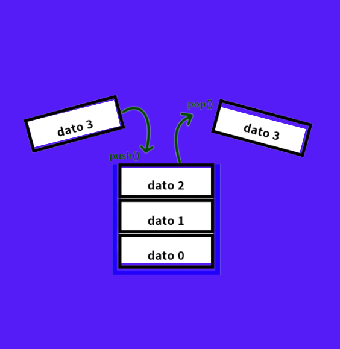
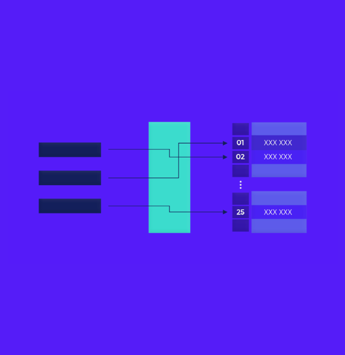

# UP210300_DSA

# DSA Course

  
  
  

 

This programming course is about  _**Data Structures and Algorithms**_, here you will find the main topics that will be reviewed as well as examples and exercises for each topic.

[Getting started](#getting-started) •
[Find me](#find-me) •
[Clone my repo](#clone-my-repo)

## Getting started

This course is conformed of four main parts:

> 1. [U1](https://github.com/UP210300/UP210300_DSA/tree/main/U1) 
> 2. [U2](https://github.com/UP210300/UP210300_DSA/tree/main/U2) 

## Find me 

>[Check me out!](https://www.linkedin.com/in/sof%C3%ADa-calder%C3%B3n-ju%C3%A1rez-352a74220/)
> 
>[Google Cloud](https://www.cloudskillsboost.google/public_profiles/226f08b0-a3df-44f7-b999-0e87c65ab458)

## Clone my repo

To clone this repo, type this command on your console.
>       git clone https://github.com/UP210300/UP210300_DSA.git

